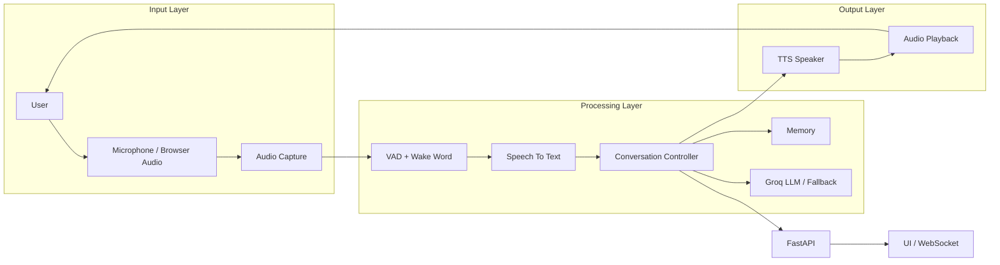
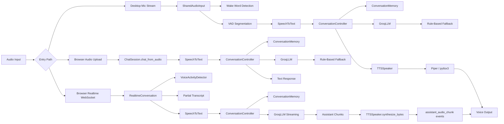
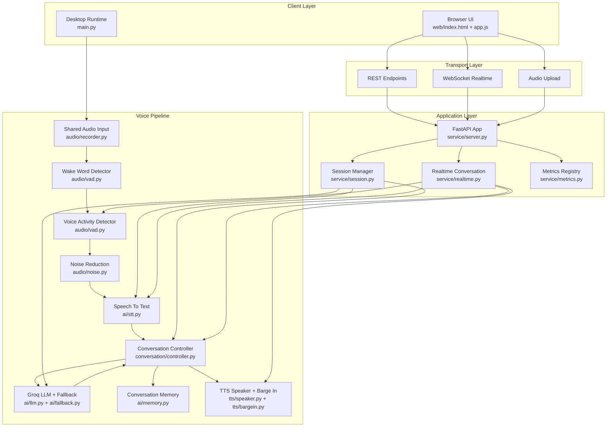
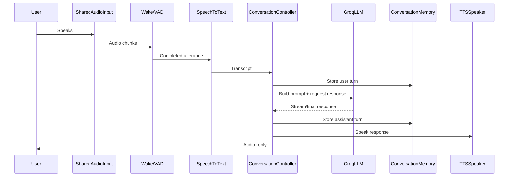
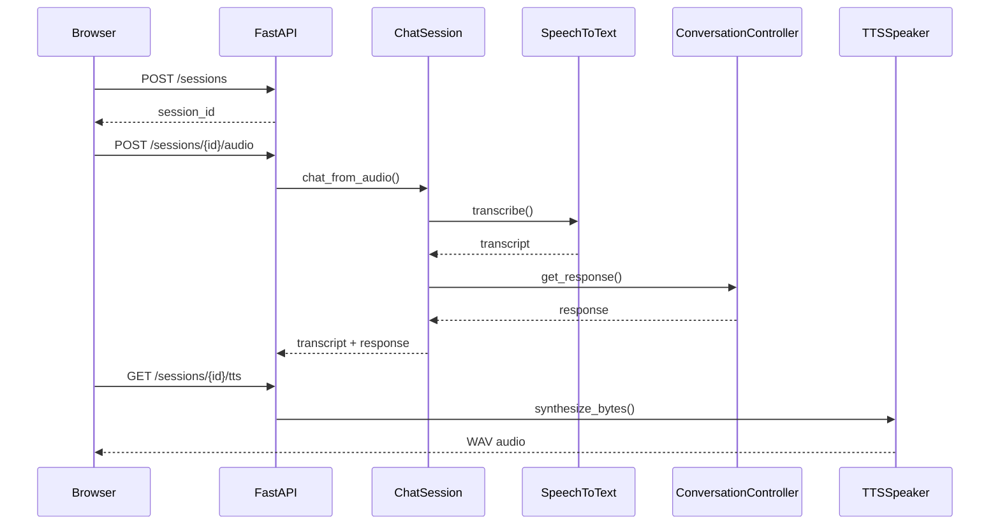

# Voice Bot AI Assistant

This project is a local-first AI voice assistant built in Python. It supports two operating modes:

- `Desktop mode`: listens through the local microphone, detects speech, converts voice to text, generates a response with Groq, and speaks the answer back.
- `API/browser mode`: exposes a FastAPI service with session-based chat, audio upload, text-to-speech, metrics, and optional realtime browser streaming over WebSocket.

The system is designed to stay usable even when premium components are unavailable. It prefers Groq for natural responses, but falls back to rule-based replies for simple commands and LLM outages. It also prefers higher-quality local speech/audio tooling when installed, while still working with lighter fallback paths.

## What We Built

We built a voice assistant platform with these capabilities:

- Shared microphone capture with subscriber queues for multiple consumers
- Voice activity detection to segment user speech
- Optional wake word detection before entering active conversation
- Speech-to-text using `faster-whisper` or `openai-whisper`
- LLM response generation using Groq
- Rule-based fallback responses for greetings, time, date, and outage recovery
- Short-term and long-term conversation memory
- Interruptible text-to-speech with Piper or `pyttsx3`
- Barge-in detection so the user can interrupt while the assistant is speaking
- FastAPI backend with multi-session chat and browser audio endpoints
- Browser UI with turn-based mode and optional realtime streaming mode
- Metrics and health endpoints for runtime visibility

## Product Goals

- Keep the assistant responsive for spoken conversation
- Prefer local/free components where possible
- Degrade gracefully when optional tools are missing
- Support both direct desktop use and browser/API integration
- Preserve context across turns with memory summarization
- Allow interruption so conversations feel natural

## High-Level Architecture


> **Note:** The following diagrams will render visually only in Markdown viewers that support Mermaid (e.g., VS Code with Mermaid extension, StackEdit, Obsidian). On GitHub, they will appear as code.



### Detailed Voice Assistant Flow

> **Note:** The following detailed flowchart will render visually only in Markdown viewers that support Mermaid (e.g., VS Code with Mermaid extension, StackEdit, Obsidian). On GitHub, it will appear as code.



## System Design Architecture

> **Note:** The following diagram will render visually only in Markdown viewers that support Mermaid (e.g., VS Code with Mermaid extension, StackEdit, Obsidian). On GitHub, it will appear as code.



## Request Flow

### Desktop Voice Flow

> **Note:** The following sequence diagram will render visually only in Markdown viewers that support Mermaid (e.g., VS Code with Mermaid extension, StackEdit, Obsidian). On GitHub, it will appear as code.



### Browser/API Flow

> **Note:** The following sequence diagram will render visually only in Markdown viewers that support Mermaid (e.g., VS Code with Mermaid extension, StackEdit, Obsidian). On GitHub, it will appear as code.



## Core Components

### 1. Entry Points

- `main.py`
  Runs the desktop assistant pipeline with background workers for wake word, VAD segmentation, STT, LLM response generation, TTS playback, and idle management.
- `service_app.py`
  Exposes the FastAPI application for API and browser access.
- `launch.ps1`
  Starts either desktop mode or API mode on Windows and auto-resolves the Python interpreter.

### 2. Audio Layer

- `audio/recorder.py`
  Manages microphone discovery, auto-selects a likely working input device, and fans out live audio to multiple subscribers.
- `audio/vad.py`
  Provides:
  - `VoiceActivityDetector` using Silero when available, otherwise energy threshold detection
  - `WakeWordDetector` using openWakeWord when available, otherwise transcript phrase matching
- `audio/noise.py`
  Applies optional noise reduction before STT.

### 3. AI Layer

- `ai/stt.py`
  Loads `faster-whisper` first when configured as `auto`, then falls back to `openai-whisper`.
- `ai/llm.py`
  Wraps Groq chat completion calls, chooses a lighter or more complex model based on user input, streams responses, and applies cooldown/circuit-breaker logic when requests fail repeatedly.
- `ai/fallback.py`
  Handles simple deterministic responses and outage fallback.
- `ai/memory.py`
  Stores recent turns, user profile facts, summary memory, and interrupted assistant replies for continuity.

### 4. Conversation Layer

- `conversation/controller.py`
  Orchestrates turn lifecycle:
  - accept user text
  - build prompt from memory
  - stream or finalize assistant response
  - persist memory
  - manage speaking and interruption state

### 5. TTS Layer

- `tts/speaker.py`
  Uses Piper when configured and available, otherwise `pyttsx3`.
- `tts/bargein.py`
  Monitors the microphone while the assistant is speaking and stops playback if the user interrupts.

### 6. Service Layer

- `service/server.py`
  Defines the FastAPI app, HTTP routes, static file hosting, TTS route, browser config, and WebSocket realtime flow.
- `service/session.py`
  Manages independent conversation sessions and supports text chat plus audio chat.
- `service/realtime.py`
  Streams partial transcripts, assistant chunks, and synthesized audio frames over WebSocket for browser realtime mode.
- `service/metrics.py`
  Tracks counters and latency snapshots.

### 7. Web Layer

- `web/index.html`
  Browser UI shell
- `web/app.js`
  Handles browser mic capture, WebSocket transport, REST fallback, WAV encoding, audio playback, and UI state
- `web/styles.css`
  Presentation layer for the browser interface

## Runtime Modes

### Desktop Mode

Use this when the assistant should run locally and talk directly through the machine microphone and speaker.

```powershell
.\launch.ps1 -Mode desktop
```

Or:

```powershell
python main.py
```

### API Mode

Use this when the assistant should be available through HTTP endpoints and the browser UI.

```powershell
.\launch.ps1 -Mode api
```

Or:

```powershell
python -m uvicorn service_app:app --host 127.0.0.1 --port 8000
```

## API Endpoints

The service exposes these main endpoints:

- `GET /`
  Serves the browser UI
- `GET /browser-config`
  Returns whether browser realtime transport is enabled
- `GET /health`
  Health summary including STT backend and active session count
- `GET /metrics`
  Returns counters and latency stats
- `POST /sessions`
  Creates a new chat session
- `GET /sessions`
  Lists sessions
- `DELETE /sessions/{session_id}`
  Deletes a session
- `POST /sessions/{session_id}/reset`
  Clears session conversation state
- `POST /sessions/{session_id}/message`
  Sends plain text to the assistant
- `GET /sessions/{session_id}/stream?text=...`
  Streams assistant text chunks as server-sent events
- `POST /sessions/{session_id}/audio`
  Uploads browser audio for transcription and response generation
- `GET /sessions/{session_id}/tts?text=...`
  Returns WAV audio for assistant speech
- `WS /ws/{session_id}`
  Realtime browser conversation channel

## Configuration

Environment values are loaded from `.env`.

Important variables:

- `GROQ_API_KEY`
- `GROQ_MODEL`
- `GROQ_COMPLEX_MODEL`
- `GROQ_MAX_TOKENS`
- `GROQ_TEMPERATURE`
- `GROQ_MAX_RETRIES`
- `GROQ_COOLDOWN_SECONDS`
- `STT_PROVIDER`
- `STT_MODEL`
- `TTS_PROVIDER`
- `TTS_VOICE`
- `PIPER_COMMAND`
- `PIPER_MODEL_PATH`
- `PIPER_CONFIG_PATH`
- `VAD_PROVIDER`
- `WAKE_WORD_PROVIDER`
- `WAKE_WORD`
- `USE_WAKE_WORD`
- `BYPASS_WAKE_WORD`
- `AUTO_CALIBRATE_NOISE`
- `NOISE_REDUCTION`
- `AUDIO_SAMPLE_RATE`
- `AUDIO_CHANNELS`
- `CHUNK_MS`
- `END_OF_UTTERANCE_SILENCE_MS`
- `IDLE_TIMEOUT_SECONDS`
- `ENABLE_BROWSER_REALTIME`

Example:

```env
GROQ_API_KEY=your_key_here
GROQ_MODEL=llama-3.1-8b-instant
GROQ_COMPLEX_MODEL=llama-3.3-70b-versatile
STT_PROVIDER=auto
STT_MODEL=tiny
TTS_PROVIDER=auto
VAD_PROVIDER=auto
WAKE_WORD_PROVIDER=auto
WAKE_WORD=hey assistant
USE_WAKE_WORD=true
BYPASS_WAKE_WORD=false
ENABLE_BROWSER_REALTIME=false
```

## Dependencies

Main dependencies from `requirements.txt`:

- `fastapi`
- `groq`
- `noisereduce`
- `numpy`
- `openai-whisper`
- `pyttsx3`
- `python-dotenv`
- `python-multipart`
- `sounddevice`
- `soundfile`
- `uvicorn`
- `websockets`

Optional upgrades:

- `faster-whisper`
- `silero-vad`
- `openwakeword`

## Fallback Strategy

The project is intentionally resilient:

- If `faster-whisper` is unavailable, it falls back to `openai-whisper`
- If Silero VAD is unavailable, it falls back to energy-threshold detection
- If openWakeWord is unavailable, it falls back to transcript phrase matching
- If Piper is unavailable, it falls back to `pyttsx3`
- If Groq is unavailable or cooling down after repeated failures, it falls back to rule-based responses

## Memory Model

Conversation memory has four parts:

- `recent_messages`
  recent turns used directly in prompts
- `summary`
  compressed long-term context from older turns
- `user_profile`
  extracted preferences, name, and factual details
- `interrupted_reply`
  last partial assistant response saved when the user barges in

This allows the assistant to stay concise while keeping continuity across longer conversations.

## Project Structure

```text
voice_bot/
|-- main.py
|-- service_app.py
|-- launch.ps1
|-- requirements.txt
|-- memory.json
|-- ai/
|   |-- fallback.py
|   |-- llm.py
|   |-- memory.py
|   |-- stt.py
|-- audio/
|   |-- noise.py
|   |-- recorder.py
|   |-- vad.py
|-- conversation/
|   |-- controller.py
|-- service/
|   |-- metrics.py
|   |-- realtime.py
|   |-- server.py
|   |-- session.py
|-- tts/
|   |-- bargein.py
|   |-- speaker.py
|-- utils/
|   |-- bootstrap.py
|   |-- config.py
|-- web/
|   |-- index.html
|   |-- app.js
|   |-- styles.css
```

## How the Desktop Pipeline Works Internally

1. `SharedAudioInput` opens a microphone stream and publishes chunks to worker queues.
2. Wake word detection waits for activation unless bypassed.
3. VAD collects speech frames and emits a finished utterance after enough trailing silence.
4. Optional noise reduction cleans the audio.
5. STT transcribes the utterance into text.
6. `ConversationController` adds the user turn to memory and prepares prompt messages.
7. `GroqLLM` produces a response or uses fallback logic.
8. The assistant stores the final response back into memory.
9. TTS speaks the answer.
10. Barge-in monitoring can stop playback if the user starts speaking again.

## How the Browser Realtime Path Works

1. Browser captures microphone audio.
2. Audio is streamed to `WS /ws/{session_id}` as PCM chunks.
3. `RealtimeConversation` runs local turn segmentation on the server.
4. Partial transcripts are emitted during speech.
5. Final transcript is sent to the session controller.
6. Assistant response text streams back chunk by chunk.
7. TTS audio is base64-encoded and returned as audio chunks.
8. Browser plays the audio and can notify the server when playback finishes.

## Setup

### 1. Clone the repository

```powershell
git clone https://github.com/Sruwat/Conversational-AI-Voicebot.git
cd Conversational-AI-Voicebot
```

### 2. Create and activate a virtual environment

Use Python 3.10 or 3.11 if possible. Audio and AI packages such as Whisper, Torch, and voice tooling can be harder to install on newer Python versions.

```powershell
python -m venv .venv
.\.venv\Scripts\activate
python -m pip install --upgrade pip
```

### 3. Install dependencies

```powershell
pip install -r requirements.txt
```

### 4. Create or update `.env`

Create a `.env` file in the project folder and add your own Groq API key. Do not commit this file.

```env
GROQ_API_KEY=your_groq_api_key_here
GROQ_MODEL=llama-3.1-8b-instant
GROQ_COMPLEX_MODEL=llama-3.3-70b-versatile
STT_PROVIDER=auto
STT_MODEL=tiny
TTS_PROVIDER=auto
BYPASS_WAKE_WORD=true
ENABLE_BROWSER_REALTIME=false
```

### 5. Run desktop mode

```powershell
.\launch.ps1 -Mode desktop
```

### 6. Run API mode

```powershell
.\launch.ps1 -Mode api -BindHost 127.0.0.1 -Port 8000
```

### 7. Open browser mode

Visit `http://127.0.0.1:8000`

## Debugging

Helpful options:

- `DEBUG_AUDIO=true`
  shows microphone activity logs
- `BYPASS_WAKE_WORD=true`
  skips wake-word gating
- `ENABLE_BROWSER_REALTIME=true`
  enables experimental realtime browser mode

Useful endpoints:

- `GET /health`
- `GET /metrics`

## Notes and Recommendations

- Rotate any exposed API keys before real deployment.
- Use Piper for better TTS quality if you want more natural voice output.
- Use `faster-whisper`, `silero-vad`, and `openwakeword` for the best local voice experience.
- Desktop mode is best for direct personal use.
- API mode is best for browser integration, demos, and future expansion.

## Future Improvement Ideas

- Add persistent session storage beyond in-memory runtime sessions
- Add authentication for hosted API deployments
- Add speaker recognition or user-specific profiles
- Add tool calling and action execution
- Add vector memory or knowledge-base retrieval
- Add Docker packaging and deployment manifests
- Add automated tests for audio, API, and session flows

## Summary

This repository contains a full voice assistant stack, not just a chatbot. It combines live audio capture, wake-word logic, VAD, STT, LLM generation, memory, TTS, interruption handling, browser support, and an API service into one system. The architecture is modular, resilient, and suitable for both local experimentation and further productization.
